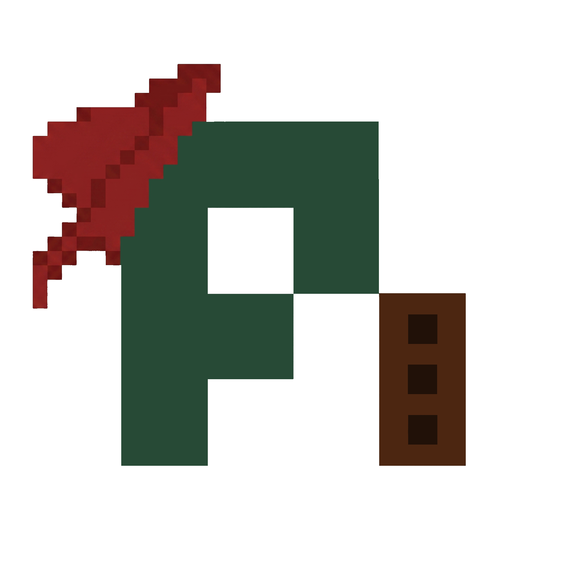

<div align="center">



# PiDE Piper — Pi Agent for VS Code

**Your AI coding agent, deeply wired into the editor.**

[](https://github.com/AcendWay/PiDE_Piper_VSCode_Extention/releases)
[](https://code.visualstudio.com)
[](LICENSE)
[](https://github.com/earendil-works/pi)
[](https://github.com/AcendWay/PiDE_Piper_VSCode_Extention)
[](https://PiEDPiPER.dev)

</div>

---

## 🧠 What is PiDE Piper?

[Pi](https://github.com/earendil-works/pi) is a terminal-native AI coding agent built for serious developers — a full TUI experience with tools, sessions, packages, and multi-model support baked in. It's fast, extensible, and runs exactly where you want it: in your terminal.

**PiDE Piper** is the VS Code layer that makes pi feel at home in your editor. Not a reimplementation. Not a chat widget. This extension wires pi's existing binary directly into VS Code as a **native terminal tab**, then adds a purpose-built sidebar for everything you'd otherwise do by hand.

> **PiDE Piper does not replace pi.** It amplifies it. Your configured providers, models, skills, extensions, and session history all carry over automatically — because we just run the `pi` binary you already have.

### What we're building together

We're building the best open-source AI coding agent integration for VS Code. The kind where:

- 🔍 Pi _always_ knows what file you're in, where your cursor is, and what errors exist
- ⚡ You can run **multiple Pi agents in parallel** and see exactly which ones are working, waiting, or asking for input
- 💬 Model switching happens _in-place_ — no terminal restart, no lost conversation
- 📊 The context window shows you a **segmented breakdown** of what's consuming tokens and what it's costing
- 💾 Your **project-lifetime spend** is tracked and survives restarts
- 🔁 A bad response is one click to rewind — non-destructively, with the original preserved
- 🎨 Every Pi tab gets a distinct color and self-describes as it works

This is open source and evolving fast. Contributions, ideas, and bug reports are very welcome.

---

## ✨ Features

### 🖥️ Native Terminal Integration

Pi runs as a **genuine VS Code terminal** — clipboard, text wrapping, scrollback, fonts, all exactly as you'd expect. No embedded webview, no terminal-lite limitations.

- Auto-detects your pi binary from `~/.bun/bin`, `~/.local/bin`, `~/.npm-global/bin`, and `$PATH`
- Registers as a **terminal profile** — pi appears in the New Terminal dropdown
- `Ctrl+Alt+P` (macOS: `Cmd+Alt+P`) opens or focuses the terminal from anywhere
- WSL2 / Windows fully supported — spawns via `wsl.exe`, bridges across the host/WSL boundary
- Auto-starts a Pi terminal when VS Code opens (configurable)

---

### 🎛️ Sidebar: Pi Agent — Multi-Tab Control Panel

The heart of the extension. A management surface for every Pi session running in your workspace.

#### 🟢 Live Multi-Tab Strip

See all your running Pi agents at a glance, each with a **live status dot**:

| Dot           | Meaning                                                          |
| ------------- | ---------------------------------------------------------------- |
| 🟢 **Green**  | Pi is actively working — LLM thinking or tool executing          |
| 🟡 **Yellow** | Turn complete, waiting for your next instruction                 |
| 🔴 **Red**    | Needs attention — blocked on a permission prompt or user query   |
| ⚫ **Gray**   | Idle past the stale threshold (default 10 min) — session is cold |

Click any row to focus that terminal instantly. The dot updates in real time.

#### ⚡ Last-Focused Tracking

The model dropdown, context bar, and action buttons always reflect **whichever Pi tab you most recently used**. No configuration — it just follows your focus.

#### 🔄 Live Model Switching

Change the model from the dropdown and Pi switches **in-place** — no terminal kill, no conversation loss, no scrollback noise. The fallback (if the SDK call fails) injects `/model <name>` into the terminal automatically. Changes you make directly in the TUI (`/model`) also sync back to the sidebar.

#### 📊 Segmented Context Window Bar

The context bar shows the real picture of your context window:

```
[████ System ████████ Conversation ██████ Tool I/O ░░░░cache]  42k · 68% · $0.14
```

- Segments: **System / Conversation / Tool I/O** with a translucent **cache overlay**
- Right-aligned readout: `tokens · % · $cost` (cost hidden for free/local models)
- **Hover tooltip** reveals the Scheme B breakdown: `system core / context files / skills / user / assistant / tool I/O`

#### 💰 Project-Lifetime Cost

Below the context bar, a **Project** row shows cumulative cost, total tokens, and session count across the entire history of your workspace. It:

- Persists across VS Code crashes and restarts via `workspaceState`
- Self-heals on activation by walking pi's session JSON files and reconciling from disk

#### 🪟 New Pi Tab

Spawn additional Pi terminals alongside your existing one. Each new tab:

- Prompts for an optional label (`refactor auth`, `fix tests`, etc.) — falls back to numbered names
- Gets a **distinct color** from a configurable palette so tabs are visually distinguishable
- Auto-titles itself from the first 30 chars of your first message (via OSC 2 escape sequences)

#### ↩️ Restart Current Session

One click to rewind the current Pi session by one user turn — **non-destructively**. A fork of the session file is created at the previous turn and pi restarts against it. The original is preserved and accessible in the Sessions view. Repeat clicks rewind successive turns.

#### 🗂️ Active File Row

Current file path, language, cursor line/column, unsaved indicator, and live error/warning counts — always visible.

---

### 📂 Sidebar: File to Context ⚠️ _(Work in Progress)_

> **Note:** This panel is currently non-functional and under active development. The UI is present but file/image injection into Pi is not yet wired up end-to-end.

A dedicated view for getting content into Pi — clean and focused, no clutter in the main panel.

- **Drop zone** — _(coming soon)_ drag images for multimodal analysis; drag files to send their path as context
- **Send Active Selection** — _(coming soon)_ one-click to send what you've highlighted in the editor

---

### 🕐 Sidebar: Sessions

Visual history of every Pi session, across projects.

- Date-grouped tree: **Today / Yesterday / This Week / Older**
- Each session shows model, message count, time ago, and first message preview
- **Resume** — reopen the exact conversation in a new terminal
- **Fork** — branch from any past session
- Forked sessions appear as children under their parent
- 🟢 Active / ⚪ Closed status indicators
- Search and filter by name, model, or project path

---

### 📦 Sidebar: Packages

Browse and manage the entire pi package ecosystem without opening a browser.

- Live npm registry feed — `pi-package` keyword (~250+ packages)
- Filter by type: **Extensions / Skills / Prompts / Themes**
- Capability labels, author, version, and media previews
- **Install / Uninstall** with live streamed output and a Cancel button
- **Installed** section pinned to the top
- **Upgrade Pi & Packages** — upgrades your pi binary and all installed packages in one shot

---

### 🌉 Bridge: 25+ VS Code Tools for Pi

When Pi starts, the extension injects a bridge extension that registers a full suite of IDE-aware tools directly inside Pi. Every tool is available automatically — Pi doesn't need to be configured, it just works.

<details>
<summary><strong>Editor & Workspace</strong></summary>

| Tool                           | What it does                                         |
| ------------------------------ | ---------------------------------------------------- |
| `vscode_context`               | Full workspace + editor snapshot                     |
| `vscode_get_editor_state`      | Active editor, open files, cursor, selection         |
| `vscode_get_selection`         | Current selection (survives terminal focus)          |
| `vscode_get_latest_selection`  | Last selection even after focus moved                |
| `vscode_get_open_editors`      | All open editor tabs                                 |
| `vscode_get_workspace_folders` | Workspace root folders                               |
| `vscode_get_diagnostics`       | Errors and warnings for a file or workspace          |
| `vscode_get_notifications`     | Buffered events: saves, editor switches, diagnostics |

</details>

<details>
<summary><strong>LSP Navigation</strong></summary>

| Tool                           | What it does                                |
| ------------------------------ | ------------------------------------------- |
| `vscode_get_document_symbols`  | File outline: functions, classes, variables |
| `vscode_get_definitions`       | Jump to definition                          |
| `vscode_get_type_definitions`  | Jump to type definition                     |
| `vscode_get_implementations`   | Find all interface implementations          |
| `vscode_get_references`        | All usages of a symbol                      |
| `vscode_get_hover`             | Type info and docs at a position            |
| `vscode_get_workspace_symbols` | Global symbol search                        |
| `vscode_get_code_actions`      | Available quick fixes at a range            |

</details>

<details>
<summary><strong>Actions</strong></summary>

| Tool                          | What it does                                  |
| ----------------------------- | --------------------------------------------- |
| `vscode_open_file`            | Open a file at a specific line/column         |
| `vscode_show_diff`            | Diff viewer against HEAD or between two paths |
| `vscode_command`              | Execute any VS Code command by ID             |
| `vscode_save_document`        | Save a file                                   |
| `vscode_apply_workspace_edit` | Apply multi-file edits atomically             |
| `vscode_format_document`      | Format a whole file                           |
| `vscode_format_range`         | Format a selection                            |
| `vscode_execute_code_action`  | Apply a quick fix by index                    |
| `vscode_show_notification`    | Show a toast notification                     |
| `vscode_report_context_usage` | Pi reports its token usage to the sidebar bar |

</details>

**Live footer feedback:** Pi's TUI status bar updates every 4 seconds with: `src/extension.ts  :142:5  typescript  ● ✗2 ⚠1`

---

## 🔧 Requirements

- **[pi coding agent](https://github.com/earendil-works/pi)** installed globally:
  ```bash
  npm install -g @earendil-works/pi-coding-agent
  # or
  bun add -g @earendil-works/pi-coding-agent
  ```
- At least one provider API key configured in pi
- VS Code **1.92+**

---

## 📥 Installation

**From source (recommended while in active development):**

```bash
git clone https://github.com/AcendWay/PiDE_Piper_VSCode_Extention
cd PiDE_Piper_VSCode_Extention
npm install
npm run package-install
```

**From a release `.vsix`:**

Download the latest `.vsix` from the [Releases](https://github.com/AcendWay/PiDE_Piper_VSCode_Extention/releases) tab, then:

```bash
code --install-extension pi-vscode-sidebar-x.x.x.vsix
```

After installing, **reload VS Code** (`Ctrl+Shift+P → Reload Window`). The **π** icon appears in the Activity Bar — click it to open the Pi sidebar.

---

## ⌨️ Commands

| Command                                    | Keybinding       | Description                                                 |
| ------------------------------------------ | ---------------- | ----------------------------------------------------------- |
| **Pi: Open Terminal**                      | `Ctrl+Alt+P`     | Open or focus the Pi terminal                               |
| **Pi: New Pi Tab**                         | —                | Spawn an additional Pi agent terminal (with optional label) |
| **Pi: Restart Current Session**            | —                | Non-destructive one-turn rewind of the current session      |
| **Pi: Open with File Context**             | Editor title bar | Send current file/cursor/selection to pi                    |
| **Pi: Send Active File/Selection Context** | Right-click menu | Send selected text or file info to pi                       |
| **Pi: Review Git Diffs**                   | —                | Ask pi to review current git changes                        |
| **Pi: Select Model**                       | —                | Quick Pick model selector                                   |
| **Pi: Upgrade Pi and Packages**            | —                | Upgrade pi binary + all installed packages                  |

---

## ⚙️ Settings

| Setting                      | Default                    | Description                                                        |
| ---------------------------- | -------------------------- | ------------------------------------------------------------------ |
| `piSidebar.piExecutable`     | _(auto-detect)_            | Override the pi binary path                                        |
| `piSidebar.terminalLocation` | `beside`                   | Where the terminal opens: `beside` / `panel` / `active`            |
| `piSidebar.defaultModel`     | _(from pi config)_         | Override the default model                                         |
| `piSidebar.startupArgs`      | `[]`                       | Extra args passed to pi on start                                   |
| `piSidebar.initialPrompt`    | _(VS Code context)_        | System prompt prefix injected on session start                     |
| `piSidebar.restoreSessions`  | `true`                     | Auto-restore sessions when VS Code reloads                         |
| `piSidebar.showOnStartup`    | `true`                     | Reveal the sidebar when VS Code starts                             |
| `piSidebar.autoStart`        | `true`                     | Launch a Pi terminal automatically on activation                   |
| `piSidebar.idleStaleMinutes` | `10`                       | Minutes before an idle session dot turns gray/stale                |
| `piSidebar.tabColorPalette`  | _(cyan, magenta, yellow…)_ | VS Code theme color IDs cycled across Pi tabs 2, 3, 4…             |
| `piSidebar.showCost`         | `true`                     | Show `$cost` on the context bar (auto-hidden for zero-cost models) |

> **Tab titles:** For live tab title updates (`Pi Agent · refactor auth`) to work, VS Code needs `terminal.integrated.tabs.title` to include `${sequence}`. The extension sets this automatically on first activation and shows a one-time notification.

---

## 🛠️ Development

```bash
npm install
npm run compile      # one-time TypeScript build
npm run watch        # rebuild on save (keep this running)
npm run typecheck    # type-check without emitting
```

Press **`F5`** to open an **Extension Development Host** with the extension loaded. The Pi sidebar appears automatically.

```bash
npm run package-install   # build .vsix and install it into VS Code
npm test                  # run unit tests (vitest)
```

### Project Structure

```
src/
├── extension.ts                  # Activation, commands, event wiring, reconciliation
├── pi.ts                         # Binary detection, env vars, arg builders
├── terminal.ts                   # Terminal creation, multi-tab tracking, session rewind
├── sessions.ts                   # Session history and workspace-state restore
├── packages.ts                   # npm registry fetch, install/uninstall, upgrade
│
├── bridge/
│   ├── server.ts                 # HTTP bridge server (token-protected)
│   ├── handlers.ts               # 30+ bridge action handlers (tab-scoped)
│   ├── listeners.ts              # VS Code events → notification buffer
│   ├── state.ts                  # Per-tab state: Map<terminalId, AgentTabState>
│   └── types.ts                  # Shared TypeScript types
│
├── lib/
│   ├── agentTabState.ts          # Tab registry: upsert/get/remove/setCurrent
│   ├── agentStateMachine.ts      # State machine: working / idle / attention / clear
│   ├── sessionRewind.ts          # Non-destructive session fork (one turn back)
│   ├── costCalculator.ts         # Token cost delta from model rate tables
│   ├── projectCostStore.ts       # Workspace-state cost persistence + reconciliation
│   ├── tabPalette.ts             # (index, palette) → ThemeColor
│   └── tabTitleEncoder.ts        # label → OSC2 escape string
│
├── views/
│   ├── controlView.ts            # Pi Agent panel: tab strip, context bar, actions
│   ├── dropzoneView.ts           # Drop Context panel: drop zone + Send Selection
│   ├── sessionsView.ts           # Sessions tree
│   └── packagesView.ts           # Package marketplace
│
└── bridge-extension/
    ├── piVscodeTools.js          # Pi-side: registers all vscode_* tools
    └── piEventBridge.js          # Pi-side: normalizes pi events → bridge calls

test/
└── unit/
    ├── sessionRewind.test.ts
    ├── agentStateMachine.test.ts
    ├── costCalculator.test.ts
    ├── agentTabState.test.ts
    └── contextBreakdown.test.ts
```

---

## 🔌 How the Bridge Works

When Pi starts, the extension passes `--extension src/bridge-extension/piVscodeTools.js` as a startup argument. That file registers all `vscode_*` tools inside Pi's tool registry. Each tool makes an HTTP POST to `http://127.0.0.1:<port>/bridge` with a shared secret token. The extension host handles the request via VS Code's API and returns the result as JSON.

Bridge state is **per-terminal**, keyed by `PI_VSCODE_TERMINAL_ID` (injected as an env var when each terminal is created). Two parallel Pi agents never share context bars, cost counters, or agent state — they're fully isolated.

On **Windows with WSL2**, the bridge binds to `0.0.0.0` and Pi uses the Windows host IP (read from `/etc/resolv.conf`) instead of `127.0.0.1`.

**pi-side event bridge (`piEventBridge.js`)** subscribes to Pi's event surface (`agent_start/end`, `turn_start/end`, `tool_execution_*`, `tool_call`, `model_select`, `message_end`, `session_start`) and forwards normalized payloads to the extension. This is how the sidebar's status dots, context bar, and cost counter stay live without polling.

---

## 🗺️ Roadmap & Known Gaps

- [ ] **VSIX marketplace listing** — self-hosted or OVSX
- [ ] **Context breakdown** (`contextBreakdown` module) requires pi to expose token estimates per message role — currently using char/4 heuristics for sub-buckets
- [ ] **Multi-root workspaces** — project cost currently keys off `workspaceFolders[0]`
- [ ] **Cross-workspace cost dashboard** — per-workspace totals exist; a unified view is future work
- [ ] **MCP-source tagging** — MCP tool tokens roll into "Tool I/O" until pi exposes an MCP-source distinction
- [x] ~~Drop zone in Pi Agent panel~~ → moved to its own **File to Context** view _(work in progress)_
- [x] ~~Single-terminal assumption~~ → full multi-tab support
- [x] ~~Model switch kills terminal~~ → live in-place switching

---

## 🙏 Credits

Built on top of the [**pi coding agent**](https://github.com/earendil-works/pi) by [Mario Zechner](https://github.com/mariozechner) / [Earendil Works](https://github.com/earendil-works). Pi is a fantastic piece of software and this extension exists entirely because of how well it was designed.

Inspired by [pithings/pi-vscode](https://github.com/pithings/pi-vscode) and [cdervis/vscode-pi](https://github.com/cdervis/vscode-pi).

---

<div align="center">


**PiDE Piper** · [PiEDPiPER.dev](https://PiEDPiPER.dev) · Open source · MIT License

_If you find this useful, ⭐ the repo and tell a friend._

</div>
